<p align="center">
  
</p>

# REZANOVA CLASSWIZ CALCULATOR

<p align="center">
  <a href="./LICENSE"></a>
  <a href="https://github.com/AhmedAlnasser2000/REZANOVA-CAS-CALCULATOR/releases"></a>
  <a href="https://github.com/AhmedAlnasser2000/REZANOVA-CAS-CALCULATOR/commits/main"></a>
  
</p>

<p align="center">
  <a href="https://github.com/AhmedAlnasser2000/REZANOVA-CAS-CALCULATOR/releases"></a>
  <a href="https://github.com/AhmedAlnasser2000/REZANOVA-CAS-CALCULATOR/releases"></a>
  <a href="https://github.com/AhmedAlnasser2000/REZANOVA-CAS-CALCULATOR/releases"></a>
  <a href="https://rezanova-cas.com"></a>
</p>

<p align="center"><sub>Linux preview builds only — see <a href="#preview-release">Preview release</a>. Windows/macOS are not yet packaged.</sub></p>
<p align="center"><sub>The browser version is the full app, not a limited demo — the only difference is where your work is saved. The desktop app saves to your file system; the browser version saves to that browser's local storage, so work saved in one won't appear in the other.</sub></p>

REZANOVA CLASSWIZ CALCULATOR is an open-source, Linux-first desktop mathematics workbench built with Tauri, React, TypeScript, Rust, and MathLive. It combines textbook-style input with dedicated workspaces for symbolic and numeric calculation, equation solving, calculus, graphing, linear algebra, statistics, geometry, trigonometry, tables, and mathematical notebook authoring.

The project is deliberately **exact-first, bounded, and evidence-oriented**. It does not claim universal computer algebra coverage. Supported routes are intended to return structured answers, conditions, exclusions, branch information, diagnostics, and controlled stops instead of silently pretending that every problem has been solved completely.

`Calcwiz` and `Classwiz` are friendly aliases. The primary public identity is **REZANOVA CLASSWIZ CALCULATOR**.

> **Development note:** the current implementation grew over roughly **four months and a few days, with 2 months intensively and the other 2 intermittent work due to university pressure**. That explains its unusually broad scope, but it is not a claim of production maturity. This repository should still be treated as an advancing preview whose mathematical and platform boundaries are stated openly.

## Project status

- **Current version:** `0.3.0`
- **Primary release direction:** Linux-first preview
- **License:** MIT
- **Input and rendering:** MathLive
- **Desktop shell:** Tauri 2
- **Frontend:** React 19 + TypeScript + Vite
- **Current posture:** functional and substantial, but still actively developed and intentionally bounded
- **Graphing:** active production workspace with renderer-neutral scene contracts, deterministic SVG reference/fallback rendering, and a private on-demand Three.js/WebGL2 adapter for interactive 3D views; the render-governor boundary allows future renderer adapters without coupling Graphing’s document, mathematics, or scene authority to Three.js.

Windows and macOS remain plausible Tauri targets, but the current release and verification work is Linux-first.

## What makes REZANOVA different

REZANOVA is not intended to be a thin interface over one expression engine. Its differentiators are the way mathematical capabilities, user intent, evidence, and dedicated workspaces are brought together:

- **Exact-first, guarded mathematics** — symbolic routes are preferred where appropriate, while numerical work is explicit and labelled.
- **Visible mathematical boundaries** — conditions, exclusions, branch restrictions, residual checks, uncertainty, and controlled unsupported cases are surfaced rather than hidden.
- **Target-aware equation solving** — the selected unknown is distinguished from symbolic parameters and stored numeric values.
- **First-class complex mathematics** — bounded exact and numeric complex solving, branch-aware evidence, complex graph mappings, Argand trajectories, domain colouring, and component views are real parts of the current project.
- **Serious symbolic integration work** — direct and rule-based integration is supplemented by bounded Risch–Norman work, Lazard–Rioboo–Trager/Rothstein–Trager-family rational-integration routes, algebraic-function reductions, elliptic/special-function output, and proof-backed non-elementary certificates.
- **Relation-first Graphing** — Graphing is not limited to `y=f(x)` and is not a detached static plot window.
- **A real Notebook environment** — rich mathematical documents, pages, images, structured blocks, persistence, revisions, and publication are part of the application rather than an external afterthought.
- **Dedicated workspaces** — Equation, Calculus, Statistics, Matrix, Vector, Geometry, Trigonometry, Table, Graphing, Notebook, Guide, Settings, and History retain domain-specific workflows instead of collapsing into one command prompt.
- **Governed execution** — Order of Execution (OOE) controls launch, host choice, cancellation, stale-result rejection, commit legality, diagnostics, and runtime evidence.
- **Regression discipline** — corpora, canaries, runtime probes, History replay, printer/result contracts, compartment checks, file-size checks, UI tests, and browser tests are treated as product infrastructure.

## Current capabilities

Everything below describes capabilities that exist in the current repository. The bounds matter; this is not a claim of full Mathematica, Maple, SageMath, FriCAS, or industrial-CAS parity.

### Graphing

Graphing is now a production app-page workspace opened through **New Graph**. It uses versioned Graph documents, renderer-neutral scenes, OOE-governed sampling and analysis, exact SVG paths for 2D output, and a private on-demand Three.js/WebGL2 renderer for supported 3D views.

 Graphing does not expose Three.js types to its mathematical, document, sampling, or renderer-neutral scene contracts. Sampled scenes pass through a render-governor and adapter boundary, allowing SVG, headless validation, Three.js, and future renderer implementations to consume the same authoritative scene model.

Current Graphing work includes:

- explicit `y=f(x)` and `x=g(y)` relations
- implicit equalities
- strict and inclusive inequality regions with shaded output
- chained conditions and structured piecewise relations
- document-local symbolic parameters and sliders
- visibility controls for individual graph items
- adaptive Cartesian and polar grids
- smooth curve tracing tied to the selected mathematical branch
- parametric and polar sampling routes
- bounded real surfaces
- Graph-owned analysis for roots, intercepts, extrema, intersections, domain features, and asymptotic evidence where supported
- separate `graph.sample` and `graph.analyze` OOE workloads
- Real, Complex, and Both view policies
- Argand-plane trajectories for complex-valued mappings
- continuous complex domain colouring
- synchronised real/imaginary, magnitude, and phase component views
- graph-local assumptions and principal branch/cut evidence
- bounded exact or numerically validated complex zero/pole evidence with explicit non-completeness
- accessible phase-colour handling
- headless scene inspection and renderer-boundary tests

Still pending in the current Graphing program are the dedicated Riemann-sheet/surface work, presentation/export closeout, durable graph-project persistence, and cross-workspace “Open in Graph” flows.

<table>
  <tr>
    <td width="50%">
      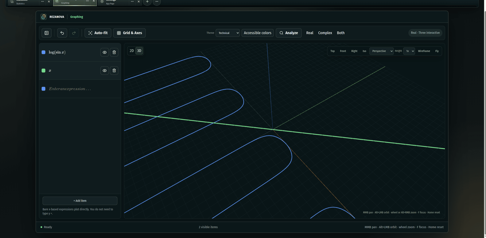
      <br />
      <sub><b>3D interactive view.</b> <code>log(sin x)</code> and <code>x</code> plotted through the private Three.js/WebGL2 renderer, with orbit/pan/zoom and Top/Front/Right/Iso/Perspective/Fly camera controls.</sub>
    </td>
    <td width="50%">
      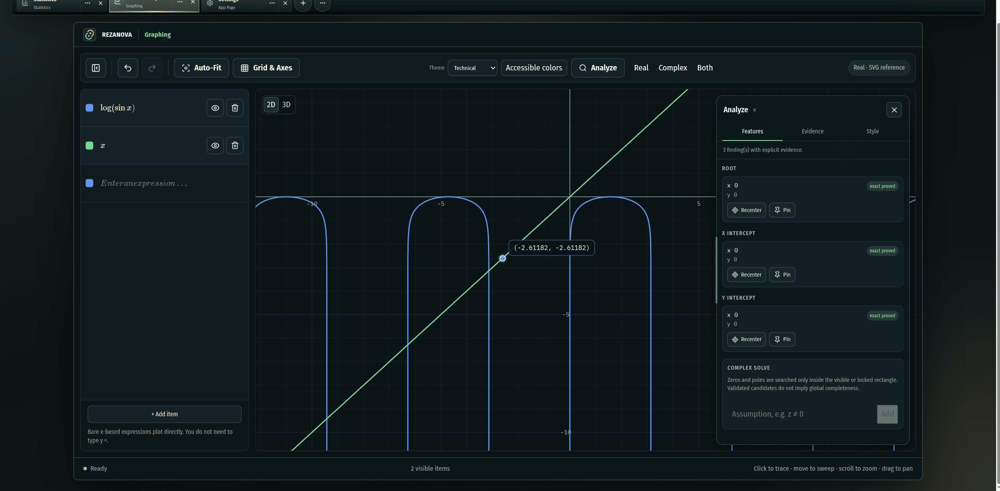
      <br />
      <sub><b>Analyze overlay.</b> The floating Analyze panel lists roots and intercepts with an <code>exact proved</code> evidence tag per finding, each with Recenter/Pin actions.</sub>
    </td>
  </tr>
  <tr>
    <td width="50%">
      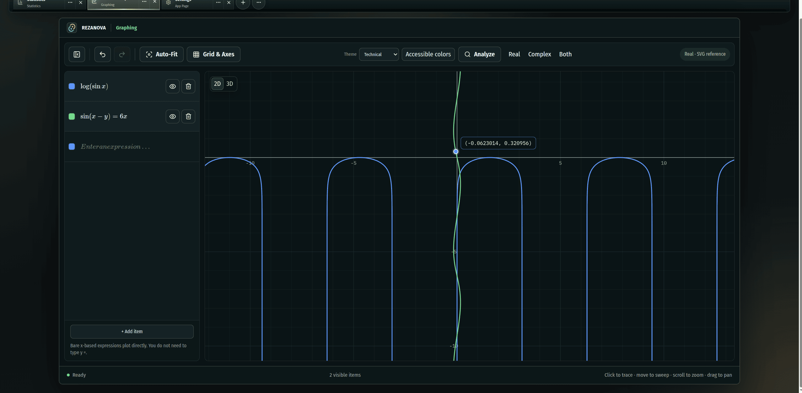
      <br />
      <sub><b>Implicit relations.</b> <code>sin(x−y)=6x</code> plotted alongside <code>log(sin x)</code>; click-to-trace reports the coordinate under the cursor.</sub>
    </td>
    <td width="50%">
      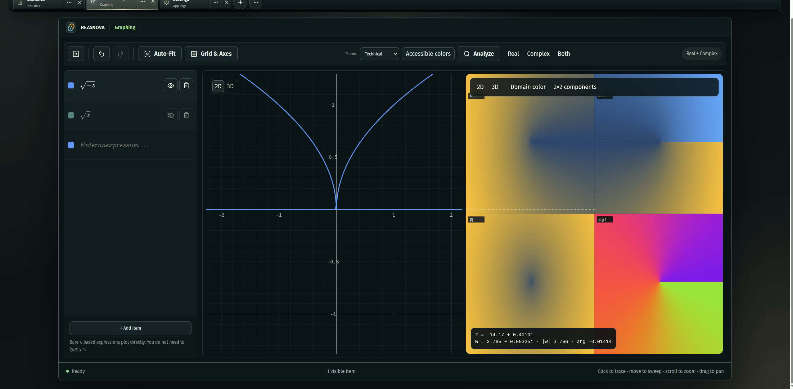
      <br />
      <sub><b>Real + Complex split view.</b> The real plot of <code>√x</code> sits beside a synced complex mapping of <code>√(−z)</code>, with a live traced-point readout (<code>z</code>, <code>w</code>, <code>|w|</code>, <code>arg</code>).</sub>
    </td>
  </tr>
  <tr>
    <td width="50%">
      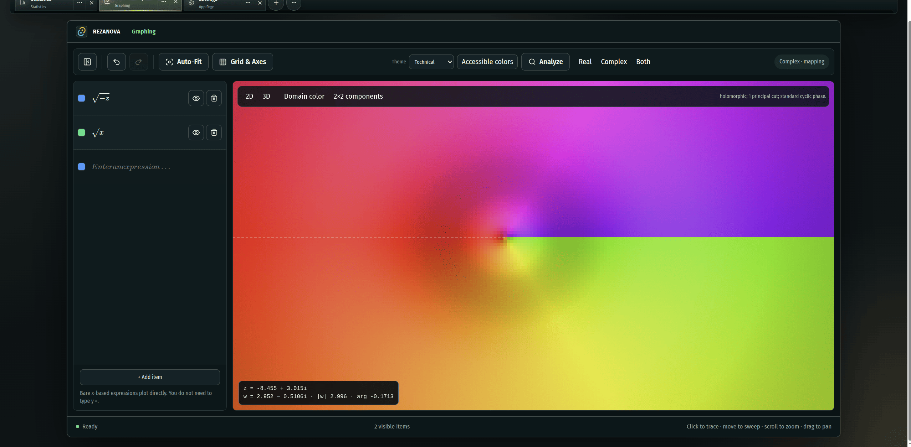
      <br />
      <sub><b>Domain color mode.</b> <code>√(−z)</code> as one continuous hue/lightness-mapped plane, annotated <code>holomorphic; 1 principal cut; standard cyclic phase</code>.</sub>
    </td>
    <td width="50%">
      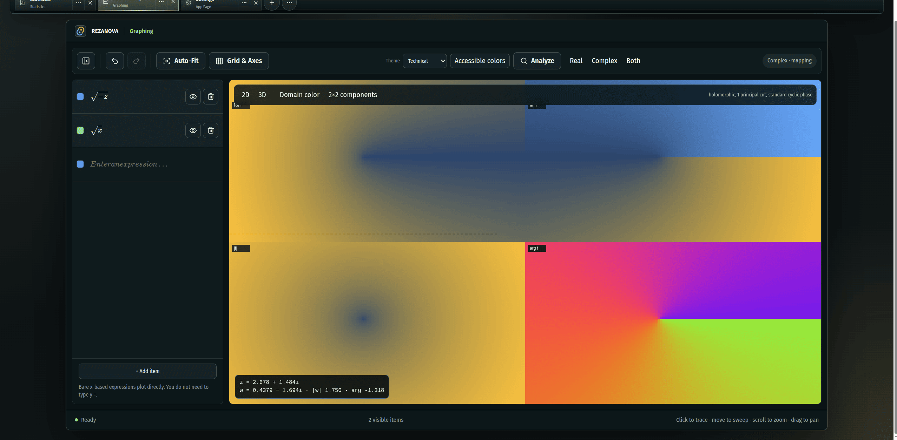
      <br />
      <sub><b>2×2 components mode.</b> The same mapping split into four synchronized panels — Re&nbsp;f, Im&nbsp;f, |f|, and arg&nbsp;f — each tracking the same traced point.</sub>
    </td>
  </tr>
</table>

### Equation solving

Equation is target-aware and preserves non-target symbols as parameters instead of silently consuming them as stored values.

Current Equation work includes:

- explicit selected targets, including case-sensitive symbols and named targets through forms such as `@mass` or `var(mass)`
- affine, linear, quadratic, rational, factorable-polynomial, exponential, logarithmic, trigonometric, composition, carrier, wrapper, and mixed-algebraic families
- guarded direct Cardano and Ferrari routes for cubic and quartic equations
- bounded higher-degree symbolic polynomial handling
- periodic trigonometric families and compact preimage readback
- real inequalities and bounded periodic-inequality routes
- 2×2 and 3×3 systems plus broader structured system/readback work
- candidate validation and extraneous-root rejection
- visible exclusions, conditions, domain facts, and branch facts
- explicit real interval solving when symbolic routes stop
- exact Complex families, including bounded complex wrappers and polynomial routes
- bounded complex-region numeric solving with residual, contour, root-count, cluster, derivative, pole-aware, and local-box evidence
- branch-safe complex pullbacks that fail closed when principal-branch safety cannot be established

Complex support is powerful but not unrestricted: global completeness, broad complex locus/set output, universal `RootOf`-style readback, and formal root certification remain outside the current claim.

### Calculus

Calculus combines guided workflows, exact symbolic routes, controlled numerical assistance, and structured proof/evidence surfaces.

Current user-facing work includes:

- derivatives and derivatives at a point
- partial derivatives
- indefinite and definite integral workflows
- finite and infinite limits
- Taylor and Maclaurin tools
- bounded differential-equation workflows
- piecewise and absolute-value limit handling
- asymptotic leading-term and scale analysis
- MRV-lite and controlled Gruntz-style limit routes
- branch-aware real/complex limit evidence for supported carriers

#### Symbolic integration highlights

The integration subsystem includes more than a lookup table, while remaining explicit about its limits:

- direct primitives and bounded substitution routes
- integration by parts and bounded recurrence families
- a substantial Tier-I/Rubi-style rule surface
- bounded **Risch–Norman** ansatz, correction, Hermite-reduction, logarithmic-derivative, and coefficient-field work
- bounded **Lazard–Rioboo–Trager / Rothstein–Trager-family** rational-integration work
- algebraic genus-0 and selected genus-1 reductions
- elliptic `F`, `E`, and `Π`-family structure where supported
- named special-function output
- proof-backed non-elementary certificate families
- structural antiderivative verification before a result is accepted
- source-backed integration and limit corpora for regression tracking

<p align="center">
  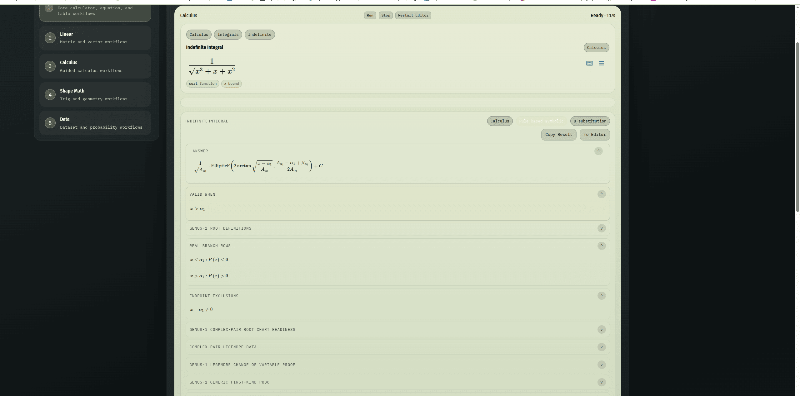
  <br />
  <sub><b>Elliptic-integral output with proof evidence.</b> <code>∫ 1/√(x³+x+x²) dx</code> resolves to an <code>EllipticF</code> term, with validity conditions, real branch rows, endpoint exclusions, and the genus-1 Legendre change-of-variable proof shown as expandable evidence rather than a bare answer.</sub>
</p>

This is practical bounded progress, **not** a complete Risch algorithm, unrestricted algebraic integration, or universal step-by-step antiderivative engine.

### Linear algebra: Matrix and Vector

Matrix and Vector are separate workspaces with independent runtime identities and bounded exact, symbolic, complex, and numerical routes.

Current Matrix work includes:

- numeric and symbolic matrix expressions
- exact arithmetic and bounded conditional symbolic elimination
- systems, RREF, rank, nullity, pivots, kernel, image, row/column spaces, and linear-map profiles
- determinants, inverses, LU, QR, and multi-right-hand-side solving
- coordinates and change of basis
- characteristic polynomials, eigenvalues, eigenspaces, diagonalisation, and spectral powers within bounded proof-gated families
- definiteness through exact principal-minor analysis where supported
- numerical SVD, pseudoinverse, 2-norm condition number, and numerical rank
- exact and decimal presentation controls with exact structure retained as canonical copy/export truth

Current Vector work includes:

- symbolic and complex vector expressions
- Hermitian dot products
- norms, units, angles, projections, and 3D cross products
- scalar triple products
- span and linear-independence classification
- Gram–Schmidt orthogonalisation
- parallelism and distance
- parallelogram area, triangle area, and 3D volume
- basis selection and dependence evidence

Bounds are route-specific. The current editing model generally accepts matrices and vectors through size 8, while exact elimination is more tightly bounded (commonly through 6×6), and symbolic spectral work is narrower still. Over-cap work stops explicitly rather than silently changing mathematical meaning.

<p align="center">
  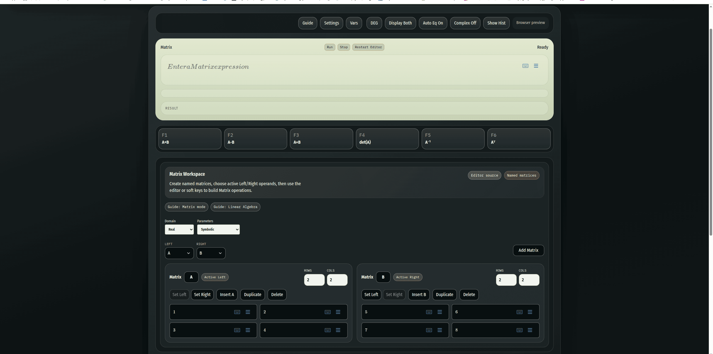
  <br />
  <sub><b>Matrix Workspace.</b> Named matrices <code>A</code> and <code>B</code> set as the active Left/Right operands, driven either through the editor or the F1–F6 softkeys (<code>A+B</code>, <code>A−B</code>, <code>A×B</code>, <code>det(A)</code>, <code>A⁻¹</code>, <code>Aᵀ</code>).</sub>
</p>

### Statistics

Statistics is an active desktop workspace rather than a dormant calculator mode. The current UI is accepted for PC/desktop layouts.

Capabilities include:

- raw datasets and frequency tables
- descriptive statistics and frequency summaries
- probability tools
- binomial, normal, and Poisson distributions
- one-sample mean inference
- regression and correlation
- relationship-quality summaries
- structured answer rows and canonical result documents
- visualization contracts and payloads for current/future result surfaces
- OOE-backed runtime requests and replay-aware output

<table>
  <tr>
    <td width="50%">
      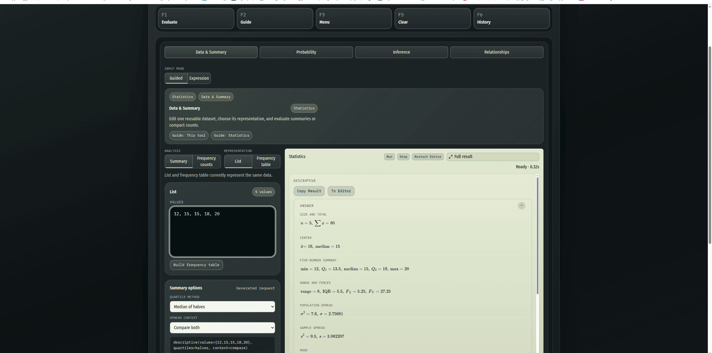
      <br />
      <sub><b>Data &amp; Summary.</b> A raw list evaluated for size/total, center, five-number summary, range and fences, and population vs. sample spread side by side.</sub>
    </td>
    <td width="50%">
      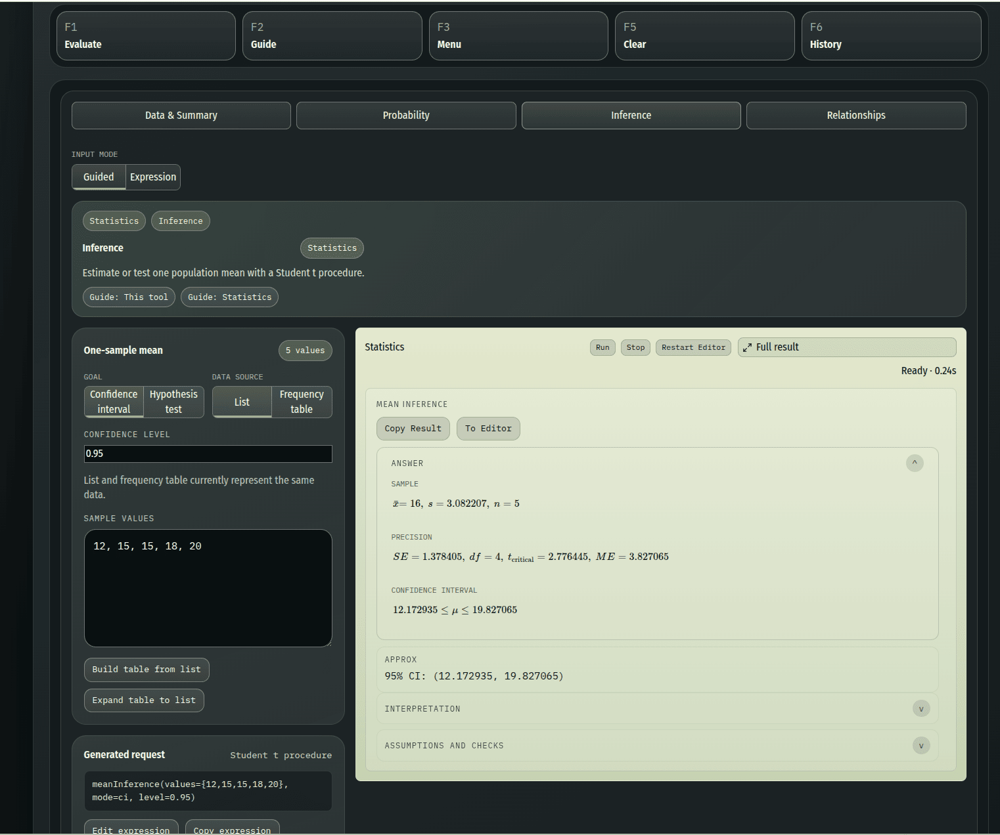
      <br />
      <sub><b>Inference.</b> A guided one-sample mean confidence interval (Student t procedure) showing sample stats, standard error/margin of error, and the resulting interval.</sub>
    </td>
  </tr>
  <tr>
    <td colspan="2">
      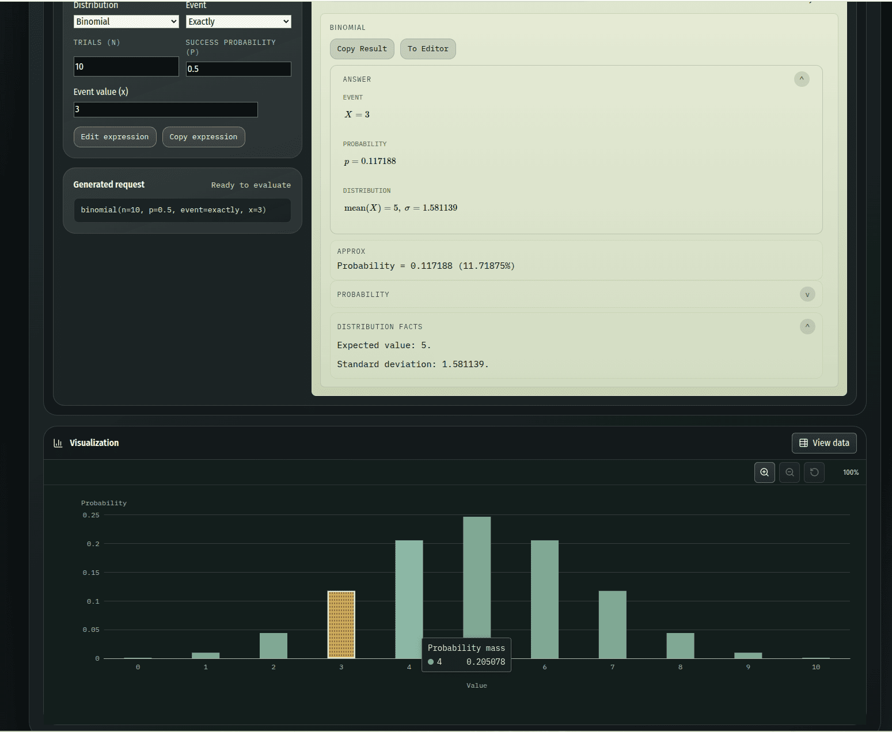
      <br />
      <sub><b>Probability.</b> A guided binomial distribution (n=10, p=0.5, X=3) with exact probability, mean/standard deviation, and a probability-mass visualization with the selected value highlighted.</sub>
    </td>
  </tr>
</table>

### Notebook

Notebook is a document-tab app page for teaching, technical writing, worked examples, and mathematical authoring.

Current Notebook work includes:

- rich Tiptap-based authoring
- headings, paragraphs, lists, sections, dividers, callouts, mathematical blocks, and other structured content
- MathLive-based mathematical input
- page setup, margins, orientation, page breaks, Print Layout, and Draft view
- headers, footers, and page-number fields
- safe local image ingestion, captions, alt text, intrinsic image metadata, crop/rotation/size controls, and floating/in-flow placement work
- outline and Objects & Layers surfaces
- templates and persistent Notebook preferences
- local document library, autosave, revisions, recovery, and Trash flows
- lossless `.cwiznb` document packages
- export-only PDF, editable DOCX, and offline Web publication projections
- schema compatibility across durable document generations with TypeScript/Rust validation

Notebook video support was removed from the current authoring/storage/publication contract after the earlier implementation proved unreliable. Image/object interaction is being consolidated around a single object-frame authority; the README does not claim that this migration is complete.

<table>
  <tr>
    <td width="50%">
      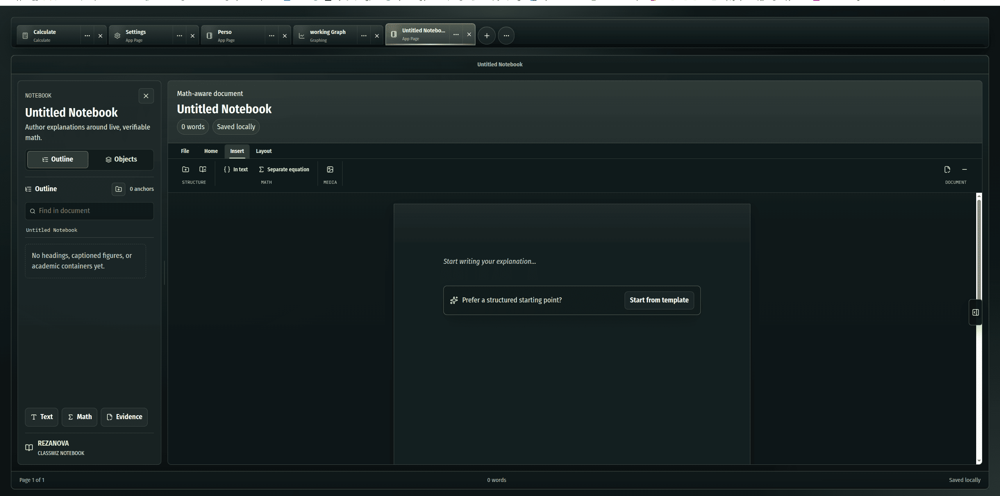
      <br />
      <sub><b>Insert tab.</b> Structure, in-text/separate-equation math blocks, and media insertion, alongside the Outline/Objects sidebar and the Text/Math/Evidence quick-add row.</sub>
    </td>
    <td width="50%">
      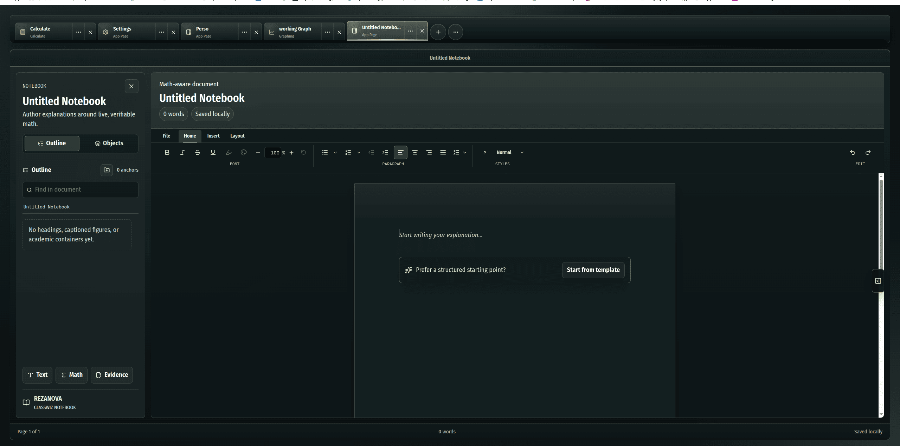
      <br />
      <sub><b>Home tab.</b> The rich-text formatting toolbar — font, alignment, lists, indentation, and paragraph styles — for authoring around the inserted math.</sub>
    </td>
  </tr>
</table>

### Other workspaces and app surfaces

- **Calculate** — expression evaluation, simplify/factor/expand, `Ans`, stored numeric values, and guarded calculus actions.
- **Trigonometry** — evaluation, identity work, equation solving, triangle tools, angle conversion, and special angles.
- **Geometry** — 2D shapes, 3D solids, triangles, circles, coordinate geometry, and solve-for-missing workflows.
- **Table** — function-table generation with active-variable protection and stored-value details.
- **Variables** — finite real stored numeric values with explicit insertion, editing, clearing, and substitution policy.
- **Guide** — searchable examples, symbols, workspace guidance, and current feature help.
- **Settings** — full app-page settings with category navigation, live previews, scale/high-contrast behavior, History notation preferences, and Notebook preferences.
- **History** — a virtualized replay ledger with timeline grouping, filters, selected-result inspection, canonical result storage, and workspace-specific replay seeds.
- **Formula Viewer** — a dedicated surface for dense formulas that should not be forced into ordinary result cards.

<table>
  <tr>
    <td width="50%">
      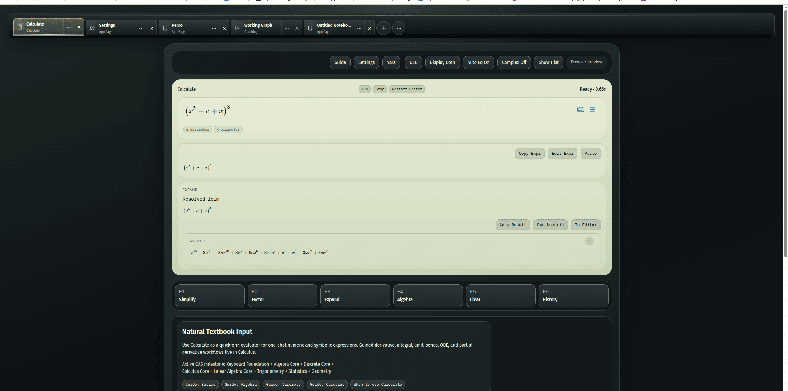
      <br />
      <sub><b>Calculate.</b> <code>(x⁵+c+x)³</code> expanded to its full polynomial via the F4 Expand softkey, with <code>c</code> and <code>x</code> tracked as distinct parameters.</sub>
    </td>
    <td width="50%">
      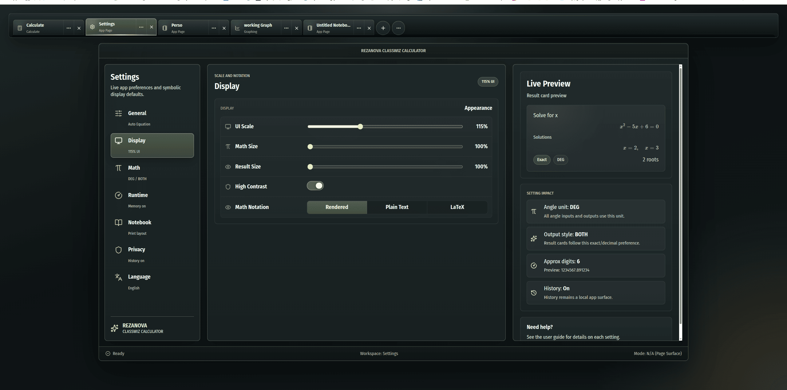
      <br />
      <sub><b>Settings.</b> Display controls (UI scale, math/result size, high contrast, notation) update the Live Preview result card and the Setting Impact summary immediately.</sub>
    </td>
  </tr>
</table>

## Mathematical honesty and current boundaries

REZANOVA is broad, but its public claims should remain precise:

- It is **not** a complete general-purpose CAS.
- Symbolic algorithms are bounded by supported families, expression growth, degree, matrix size, branch safety, and proof/validation budgets.
- Risch–Norman and LRT/Rothstein–Trager-family work is real but incomplete.
- Complex solving is strong in selected exact and bounded numeric families, not globally complete.
- Graphing supports many 2D, complex, and bounded 3D forms, but Riemann work and the export/presentation closeout remain unfinished.
- Notebook supports rich documents and images; video is not currently supported.
- Statistics is currently a desktop/PC-oriented experience.
- Spreadsheet, a full Variables management page, public plugins, a public SDK, remote compute, and Surface Protocol mounting remain future work.
- The mathematical kernel is not yet Rust-first; most product mathematics remains TypeScript today.
- Arabic/right-to-left localization remains future work.
- Important results should be independently verified, especially in a preview release.

## Architecture snapshot

- **Frontend:** React 19 + TypeScript + Vite
- **Desktop shell:** Tauri 2
- **Math input/rendering:** MathLive
- **3D/accelerated Graphing backend:** private Three.js/WebGL2 adapter
- **Symbolic layer:** Compute Engine plus substantial app-owned algebra, equation, calculus, and result-authority modules
- **Persistence:** Tauri-backed settings, History, calculator memory, Variables, Notebook documents/assets, and browser fallback where supported
- **Execution governance:** Order of Execution (OOE)
- **Validation:** Vitest, Testing Library, Playwright, ESLint, Rust checks, corpora, canaries, runtime probes, boundary validators, and replay fixtures

Architecture at a glance:

- `src/App.tsx` — import shell
- `src/AppMain.tsx` — visual/runtime orchestration root
- `src/app/*` — app pages, workspace views, shell surfaces, routing, and presentation
- `src/lib/graphing/*` — graph contracts, parser, evaluator, sampling, analysis, scenes, OOE, and renderer boundaries
- `src/lib/notebook/*` — Notebook documents, media, persistence, publication, templates, and compatibility
- `src/lib/equation/*` — guarded real/complex equation solving and evidence
- `src/lib/calculus/*` and `src/lib/symbolic-engine/integration/*` — calculus workflows and symbolic integration routes
- `src/lib/linear-algebra/*` — Matrix/Vector exact, symbolic, complex, and numerical cores
- `src/lib/statistics/*` — statistics parsing, calculations, readback, inference, distributions, and visualization contracts
- `src/lib/ooe/*` — runtime traffic control, diagnostics, pilots, jobs, events, and bridge schemas
- `src/lib/compartments/*` — ownership and boundary contracts
- `src/lib/display/*` and result contracts — canonical mathematical presentation and printer policy
- `src/lib/surface-protocol/*` — hostless future integration spine; not mounted publicly
- `src-tauri/*` — desktop shell, Rust integration, persistence, and native commands
- `e2e/*` — browser interaction and visual regression coverage
- `benchmarks/*` — equation, integration, limits, and other corpus ledgers
- `tools/*` — architecture, contract, CI, freshness, and boundary validators

## Project structure overview

```text
.
├─ src/
│  ├─ App.tsx
│  ├─ AppMain.tsx
│  ├─ app/
│  ├─ components/
│  ├─ lib/
│  │  ├─ graphing/
│  │  ├─ notebook/
│  │  ├─ equation/
│  │  ├─ calculus/
│  │  ├─ linear-algebra/
│  │  ├─ statistics/
│  │  ├─ ooe/
│  │  ├─ compartments/
│  │  └─ surface-protocol/
│  ├─ styles/
│  ├─ test/
│  └─ types/
├─ src-tauri/
├─ benchmarks/
├─ e2e/
├─ docs/
├─ playground/
└─ tools/
```

## Getting started

### Prerequisites

- Node.js
- npm
- Rust toolchain
- Tauri system prerequisites for your platform

For Tauri system prerequisites, see:
- https://tauri.app/start/prerequisites/

### Install

```bash
npm install
```

### Run in browser development mode

```bash
npm run dev
```

### Run the desktop app in development

```bash
npm run tauri:dev
```

The default desktop development command disables Tauri's Rust file watcher and runs a Linux preflight that checks WebKitGTK and inotify limits before Tauri starts. If the preflight reports low file-watch limits, run:

```bash
npm run fix:linux-watch-limits
```

Then reopen VS Code or close other watcher-heavy applications and rerun `npm run tauri:dev`.

To enable Rust hot reload when the operating-system watch limits can support the repository:

```bash
npm run tauri:dev:watch
```

### Build

```bash
npm run build
npm run tauri:build
```

## Preview release

REZANOVA CLASSWIZ CALCULATOR is following a Linux-first preview-release path.

- Source builds are available through the commands above.
- Packaged preview artifacts are produced by the `Release Linux` GitHub Actions workflow.
- The first public packages should be treated as early previews, not production-stable releases or claims of full CAS parity.
- Verify important mathematical results independently.

Release documentation:

- [First public preview checklist](docs/release/first-public-preview-checklist.md)
- [Release process](docs/release/release-process.md)
- [Changelog](CHANGELOG.md)

## Validation and testing

The repository uses several layers of verification rather than one test suite alone.

Common commands:

```bash
npm run test:unit
npm run test:ui
npm run test:e2e
npm run test:gate
```

`npm run test:gate` is the strongest broad local command. It includes the primary unit/contract, UI, browser, lint, and Rust checks configured by the repository.

More focused gates include:

```bash
npm run test:graph-contracts
npm run test:graph-parser
npm run test:graph-sampling
npm run test:graph-scene
npm run test:graph-ooe
npm run test:notebook-schema-compatibility
npm run test:notebook-gesture-ratchet
npm run test:history-replay
npm run test:runtime-probes
npm run test:canaries
npm run test:compartments-boundaries
npm run test:surface-protocol
npm run test:ci-gate-alignment
```

The repo also carries source-backed mathematical corpora, workspace freshness checks, file-size ratchets, printer/result-contract checks, and browser canaries.

## Contributing

Contributions are welcome, especially in:

- mathematical correctness and counterexamples
- symbolic and numeric edge cases
- Graphing algorithms and interaction quality
- integration, limits, Equation, Statistics, and Linear Algebra coverage
- Notebook authoring and publication reliability
- accessibility and UI clarity
- performance profiling
- regression tests, corpora, and documentation

Before opening a pull request:

1. inspect the relevant public facade and compartment boundary;
2. preserve exact/approximate and evidence semantics;
3. keep public claims aligned with implemented bounds;
4. run the focused tests for the changed area;
5. run the broad validation gate when practical.

```bash
npm run test:gate
```

## License

This project is licensed under the MIT License. See [LICENSE](./LICENSE) for details.
